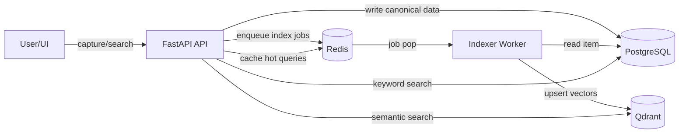

# Memory Dropbox

Memory Dropbox is a Docker-first brain-dump framework designed to show clear engineering progression:

- practical personal capture + retrieval today
- package-ready Python internals for reuse tomorrow
- scalable architecture path (Compose -> Kubernetes -> distributed memory layers)

## Why this exists

Long term, Memory Dropbox should be easy to adopt as a **portable memory layer**: install it (Docker or package), connect clients (chat, agents, bookmarklets, uploads), and retrieve later with keyword and semantic search—so a saved article or note is always findable in your workflow.

This project follows the same modular spirit as your ObversaryOS work while focusing on a concrete user outcome:

1. dump raw information fast
2. index it
3. retrieve it via keyword, semantic, and hybrid search

## Architecture at a glance



## Stack

- **FastAPI** (`apps/api`) for endpoints + minimal UI
- **PostgreSQL** as system of record
- **Qdrant** for vector retrieval
- **Redis** for cache and async queue
- **Worker** (`apps/worker`) for background embedding/index jobs
- **Reusable package** (`packages/memory_dropbox`) for core logic

## GitHub, Codespaces, and CI

The repo includes **GitHub Actions** (lint + Compose validation) and a **devcontainer** for Codespaces. To host it under **[obversary-studios](https://github.com/obversary-studios)**, push to GitHub and open the Actions tab—see [`docs/GITHUB_AND_CI.md`](docs/GITHUB_AND_CI.md) for remotes, branch protection, and optional deploy webhooks.

## Quickstart

```bash
cd /home/oscar/gitboy/repos/memory-dropbox
cp .env.example .env
docker compose up --build -d
```

Open:
- `http://localhost:8000` (UI)
- `http://localhost:8000/docs` (OpenAPI)

If `localhost` is unstable on your machine, use:
- `http://127.0.0.1:8000`

## Implementation notes

- Development included a local Docker networking workaround cycle (port-forward resets and startup races).
- Final startup uses a dependency wait step before Alembic migration:
  - `apps/api/app/wait_for_services.py`
- See `docs/IMPLEMENTATION_NOTES.md` for a concise timeline of fixes and why they were made.

## Main endpoints

- `POST /ingest/text`
- `POST /ingest/file`
- `GET /items`
- `GET /items/{id}`
- `PATCH /items/{id}`
- `GET /search?query=...`
- `GET /search/semantic?query=...`
- `GET /search/hybrid?query=...`
- `GET /health`

## Project structure

- `apps/api`: FastAPI app + routers + templates + Alembic
- `apps/worker`: Redis-backed indexing worker
- `packages/memory_dropbox`: db models, repositories, search, queue, vector adapters
- `infra/docker`: Dockerfiles and environment templates
- `infra/k8s`: starter manifests for future scaling
- `docs`: architecture, decisions, roadmap, evaluation

## Milestones

- `v0.1`: capture + Postgres persistence + browse
- `v0.2`: semantic retrieval with Qdrant
- `v0.3`: hybrid retrieval + Redis queue/caching
- `v0.4`: worker indexing + retrieval evaluation harness
- `v0.5`: Kubernetes deployment skeleton + scaling notes

## Progression narrative for recruiters/labs

- **Stage 1**: local-first personal memory engine (capture, queue, retrieval).
- **Stage 2**: reusable package boundaries (`packages/memory_dropbox`) for ecosystem growth.
- **Stage 3**: distributed-ready operations path (Docker now, Kubernetes next, swarm orchestration later).
- **Stage 4**: measurable retrieval quality via evaluation harness and milestone tags.

## Packaging plan

- core logic already lives under `packages/memory_dropbox`
- `pyproject.toml` included for future pip packaging
- app and worker import that package directly, preserving clean boundaries

