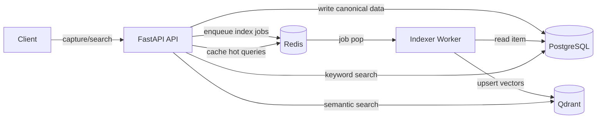

# Memory Dropbox

Memory Dropbox is a Docker-first memory substrate prototype for capturing raw information, preserving event history, deriving memory records, and retrieving items through keyword, semantic, and hybrid search.

**Shorter tagline:** Event-first memory infrastructure for inspectable AI systems.

**Public caveat:** This is a prototype memory substrate, not a finished assistant or production memory platform.

## Why this exists

The goal is a **small, inspectable stack** you can run locally (Docker Compose), extend in Python (`packages/memory_dropbox`), and link from a lab website without over-claiming scope.

What you get today:

1. Ingest text or **text-like files** and persist them in PostgreSQL with an event trail.
2. Background worker builds deterministic local embeddings and indexes vectors in Qdrant.
3. Search via keyword (Postgres FTS), semantic (Qdrant), or hybrid orchestration.
4. Explorer JSON routes plus a **three-panel Jinja UI** (capture → trail → search/trace)—still no React SPA.

### Scope (honest)

No authentication, no in-repo cloud deploy automation, no external LLM API wiring, **no PDF/binary extraction** (file ingest is UTF-8 text split on blank lines—see below), and no separate frontend framework—the FastAPI app ships templates only.

For architecture narrative, see [`docs/ARCHITECTURE.md`](docs/ARCHITECTURE.md), [`docs/DECISIONS.md`](docs/DECISIONS.md), and [`docs/ROADMAP.md`](docs/ROADMAP.md).

### File ingest (`POST /ingest/file`)

The handler reads the uploaded body as **UTF-8 text** (invalid bytes ignored) and splits on blank lines into items. That matches **`.txt` / `.md` / other text-like** uploads. It does **not** parse PDFs or arbitrary binaries—plan a dedicated extractor or connector (for example a pdf-intelligence pipeline) when you add that layer.

## Prerequisites

- **Docker** and **Docker Compose** v2 (`docker compose`).
- Roughly **2 GB** free disk for images and volumes.

## Quickstart

```bash
git clone https://github.com/architectfromthefuture/memory-dropbox.git
cd memory-dropbox
cp .env.example .env
docker compose up --build -d
```

Open:

- `http://localhost:8000` — three-panel explorer (`/`)
- `http://localhost:8000/ui/memory` — memory activity feed (HTML)
- `http://localhost:8000/docs` — OpenAPI

If `localhost` misbehaves on your OS, use `http://127.0.0.1:8000`.

```bash
docker compose down -v   # stop and drop volumes
```

### Docker networking

All services use **normal Compose networking** (service DNS names for Postgres, Redis, and Qdrant). There is **no** `network_mode: host` on the API—bring-up should behave consistently on Linux and Docker Desktop.

## Architecture at a glance



## Stack

| Piece | Role |
|--------|------|
| **FastAPI** (`apps/api`) | HTTP API + Jinja templates + Alembic migrations |
| **PostgreSQL** | System of record |
| **Qdrant** | Vector retrieval |
| **Redis** | Queue + cache |
| **Worker** (`apps/worker`) | Embedding and index jobs |
| **`packages/memory_dropbox`** | Shared DB, search, queue, vector adapters |

## Main HTTP endpoints

**Core**

- `POST /ingest/text`
- `POST /ingest/file` (text-like files only; see above)
- `GET /items`, `GET /items/{id}`, `PATCH /items/{id}`
- `GET /search`, `/search/semantic`, `/search/hybrid`
- `GET /health`

**Memory explorer (JSON)**

- `GET /events`
- `GET /memory/activity` — counts (`items`, `events`) plus merged `activity` rows from `get_recent_memory_activity`
- `GET /memory/derived`
- `GET /memory/observations`

**UI**

- `GET /` — three-panel explorer
- `GET /ui/memory` → redirect to `/`
- `GET /ui/items/{id}` — single item view

## Tests & Makefile

```bash
pip install -r requirements-dev.txt
make test              # pytest (activate venv or ensure pytest on PATH)
make compose-config    # docker compose config --quiet
make lint          # ruff + compileall
```

## Suggested upgrade phases

| Phase | Focus |
|-------|--------|
| **1 — Docker** | Compose service DNS only (done); healthchecks; API/worker reach deps |
| **2 — Public repo** | README honesty, `.env.example`, tests, Makefile, CI |
| **3 — Jinja polish** | Richer panels (capture, trail, search/trace)—stay on templates until needed |
| **4 — Memory explorer** | More JSON + UI around events, derived memory, observations |

## Project layout

- `apps/api` — FastAPI app, routers, templates, Alembic
- `apps/worker` — Redis-backed indexer
- `packages/memory_dropbox` — domain logic
- `infra/docker` — Dockerfiles
- `infra/k8s` — optional starter manifests (not a hosted deploy recipe)
- `tests/` — pytest smoke tests

## GitHub, Codespaces, and CI

GitHub Actions runs lint, Compose validation, pytest, and `.env.example` key checks. See [`docs/GITHUB_AND_CI.md`](docs/GITHUB_AND_CI.md).

## Implementation notes

Startup waits for Postgres, Redis, and Qdrant before migrations (`apps/api/app/wait_for_services.py`). Details in [`docs/IMPLEMENTATION_NOTES.md`](docs/IMPLEMENTATION_NOTES.md).

## Packaging

Core logic lives under `packages/memory_dropbox`; `pyproject.toml` supports future packaging while apps import that package with `PYTHONPATH`.
